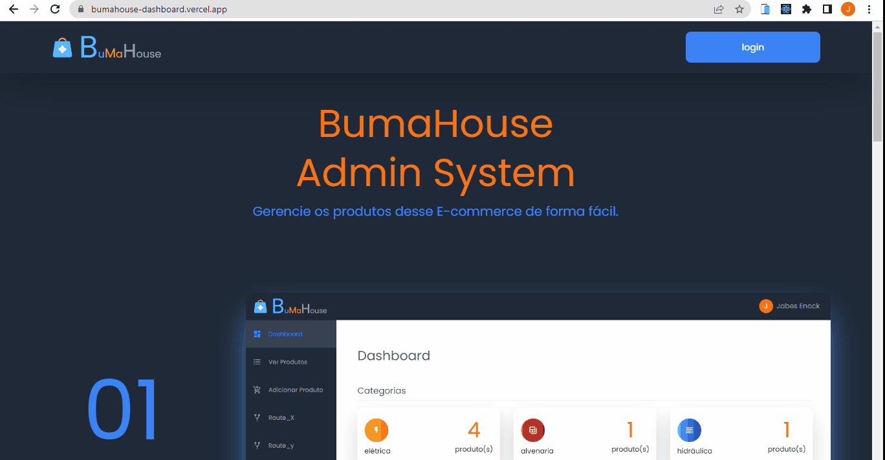
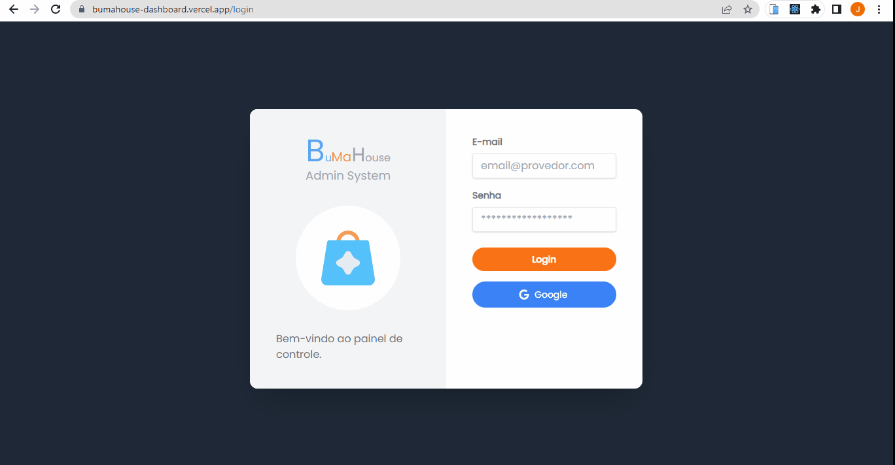
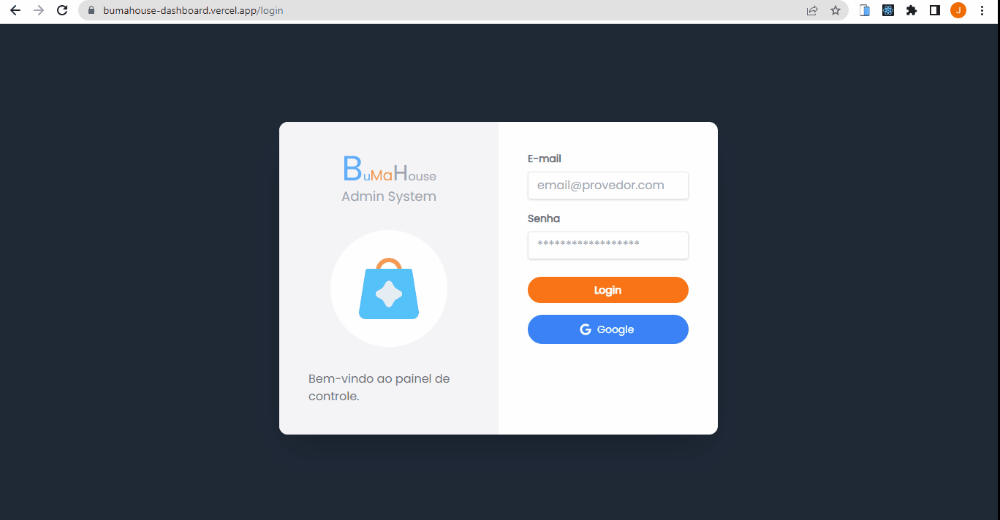
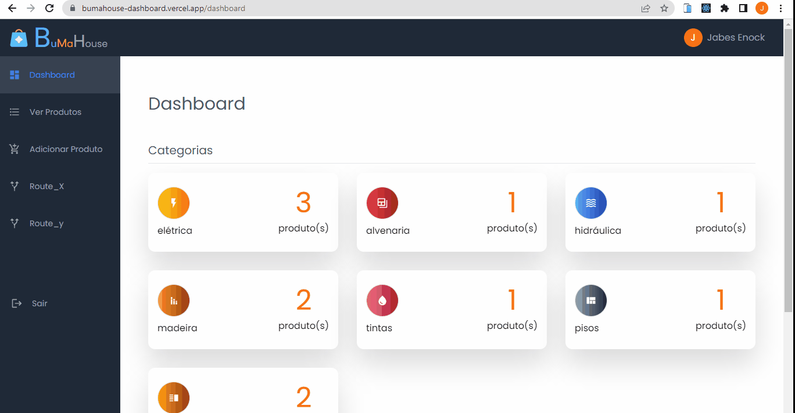
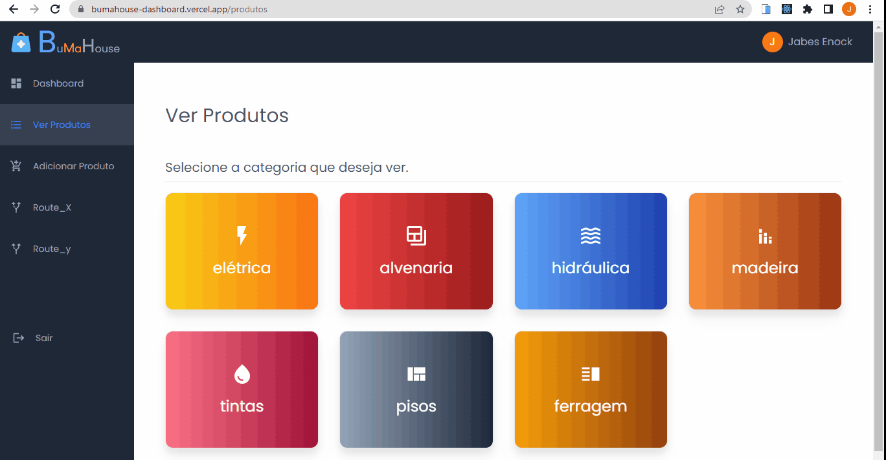

###  

 

## Login

##### Email and Password
<small> To login to the Bumahouse website, use these credentials.</small>

<b>Email:</b>  bumahouse@gmail.com

<b>Senha:</b> bumahouse

 

##### Google
Select any account
 

<b>Note: You are not allowed to create, edit or delete a product.</b>

## <a href="https://bumahouse-dashboard.vercel.app/">Live demo</a>

I'm currently writing the documentation but while I'm doing it you can see some parts of this application running in some Gifs below.

### Home

  

### Private routes

  

### Authentication with email and password 

  

### Authentication with Google 

  

### Dashboard 

  

### Produtos 

  

### CRUD operations 

  

  

Made by Jabes Enock
