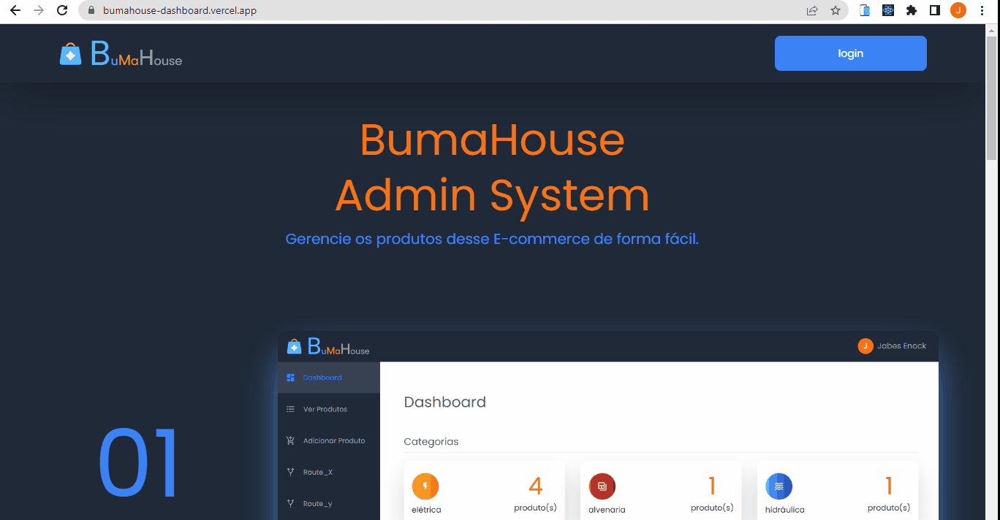
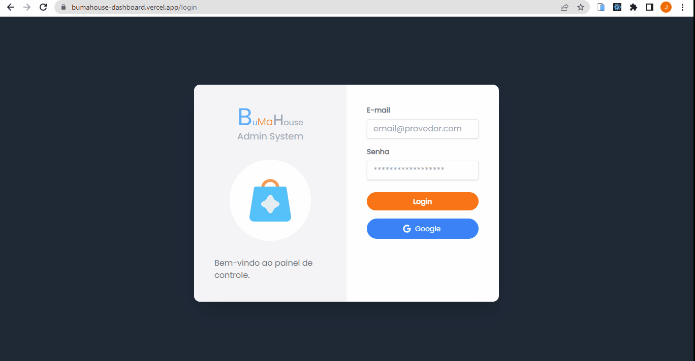
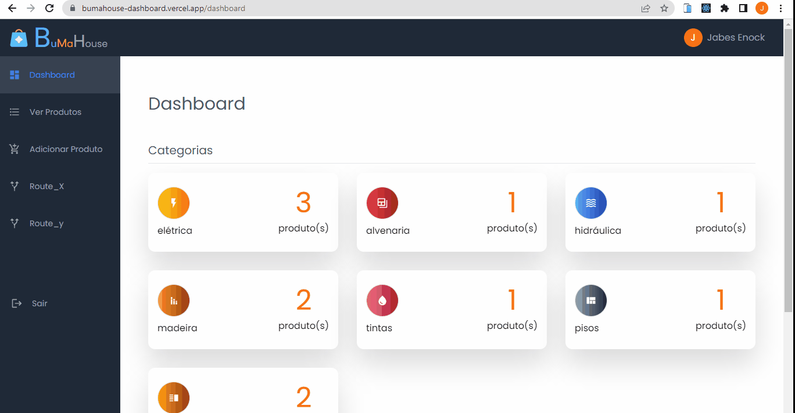
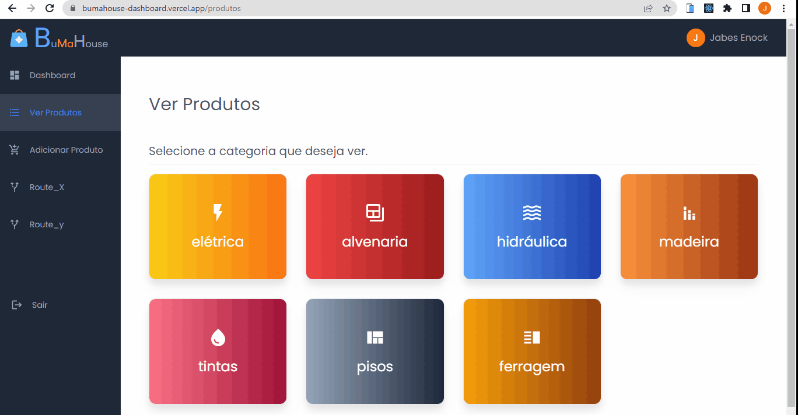

# Bumahouse - building materials house

## :bookmark_tabs:Summary

1. [Introduction](#Introduction)
2. [Demo](#live-demo)
3. [Features and some gif's ](#features-and-demo)
4. [Technologies](#Technologies)
5. [Installation](#Installation)
6. [Categories](#categories)
7. [My opinion about this project](#opinion)

 

## :page_facing_up:Introduction
This project is a dashboard where you can manage your store by adding new products, deleting or just viewing all products registered in your database.

I used a firebase database :fire: for this application, so authentication is handled by it as well as data storage.

 

## :camera: Login

Email and Password: To login to the Bumahouse website, use these credentials.

:email: <b>Email</b>: bumahouse@gmail.com
:key: <b>Senha:</b> bumahouse

Google: Select any account

:exclamation: Note: You are not allowed to create, edit or delete a product.:exclamation: 

### :camera: [LIVE DEMO](https://bumahouse-dashboard.vercel.app/) :video_camera:
:exclamation: OBS: if you can't access it, it means it has been discontinued or paused. :exclamation:

 

## :checkered_flag: Features and demo
Here you will see the main resources used in this project, as well as some Gif's.
### Home

  

### :lock: Private routes
I added some private routes to this project to allow only authenticated people to access the dashboard.

  

### :closed_lock_with_key: Authentication with email and password 

  

### :lock_with_ink_pen: Authentication with Google 

  

### Dashboard 

  

### Produtos 

  

### CRUD operations 

  

 

## :bar_chart: Technologies and Libraries

##### :one: React
[React docs](https://pt-br.reactjs.org/docs/getting-started.html). - "React is a JavaScript library developed by Facebook..."

 

##### :two: React-router-dom v6
 [See documentation here (V6)](https://reactrouter.com/docs/en/v6/getting-started/overview).
 * BrowserRouter
 * Routes
 * Route 
 * Navigate 
 * Outlet 
 * Link
 * useNavigate 
 * useParams

 

##### :three: React-icons
[Documentation - React-icons](https://react-icons.github.io/react-icons/). - I chose [Material Design icons](https://react-icons.github.io/react-icons/icons?name=md).

 

##### :four: Formik + Yup
[Formik Docs](https://formik.org/docs/overview) | [Yup API](https://www.npmjs.com/package/yup#api)
  These are libraries for validating form data and handling errors, used together.

 

##### :five: Tailwindcss
[See docs](https://tailwindcss.com/docs/installation) - "A utility-first CSS framework"
  
 

##### :six: Firebase :fire:
[Click here](https://firebase.google.com/?hl=pt) - Firebase is a Backend-as-a-Service (Baas). 

 ###### Authentication
  * Email/password
  * Google

  Methods:
  * createUserWithEmailAndPassword
  * signInWithPopup
  * signInWithEmailAndPassword
  * onAuthStateChanged
  * signOut

###### Firestorage Database
  * Doc
  * AddDoc
  * Collection
  * getDoc
  * getDocs
  * UpdateDoc

###### Storage
  * ref 
  * uploadBytesResumable 
  * getDownloadURL

 

## :computer: Installation

#### Step 1 - Download this project
  ##### Option :one: - Download Zip 
  ##### Option :two: - Cloning a repository - [how to do this](https://docs.github.com/en/repositories/creating-and-managing-repositories/cloning-a-repository). 
 

#### Step 2 - Install Dependencies
    npm install 
 

#### Step 3 - Login to your google account and create a new firebase project. [Click Here](https://console.firebase.google.com/u/0/), then Register a new app.
 

#### Step 4 - Create an .env file in the project root and add the following configuration details. 
You can find this information in your Firebase project settings.

    REACT_APP_FIREBASE_API_KEY= AIzaKJgkjhSdfSgkjhdkKJdkjowf
    REACT_APP_FIREBASE_AUTH_DOMAIN= YOUR-PROJECT-NAME.firebaseapp.com
    REACT_APP_FIREBASE_PROJECT_ID= YOUR-PROJECT-FIREBASE-PROJECT-ID
    REACT_APP_FIREBASE_STORAGE_BUCKET= YOUR-PROJECT-NAME.appspot.com
    REACT_APP_FIREBASE_MESSAGING_SENDER_ID= YOUR-PROJECT-SENDER-ID
    REACT_APP_FIREBASE_APP_ID= YOUR-PROJECT-APP-ID
    REACT_APP_FIREBASE_MEASUREMENT_ID=G-"YOUR-MEASUREMENT_ID"
 

#### Step 5 - After setting up necessary configuration, search for "product categories" and open "build", you need to allow 3 services there.
 

##### :one: Authentication
  Click to start it, you will be in the "sign-in-method". Click to add Email/password and active it. Do the same to Google option.
   

##### :two: Firestore Database
Click to create your database and choose your configuration
 

##### :three: Storage
Click to create your storage, We need it to save images.
 

##### :warning: Now if you run the project it will work but the only Firebase service we can use is authentication.
 

#### Step 6 - Setting up Rules .

By default you can't read or write data to the Firebase cloud :no_entry:

##### firestorage database

    rules_version = '2';
    service cloud.firestore {
      match /databases/{database}/documents {
        match /{document=**} {
          allow read, write: if false;
        }
      }
    }
 

If you want everyone to be able to read and write data, add this, but be careful.:warning:

    rules_version = '2';
    service cloud.firestore {
      match /databases/{database}/documents {
        match /{document=**} {
          allow read, write: if true;
        }
      }
    }
   

Change to this if you want to have one person with full permission but for production deployment You should know more about [Firebase Security Rules](https://firebase.google.com/docs/rules?authuser=0)

    rules_version = '2';
    service cloud.firestore {
      match /databases/{database}/documents {
        match /{document=**} {
          allow read: if true;
          allow write: if request.auth != null && request.auth.uid == 'User_ID_with_permission';
        }
      }
    }
You can find this 'User_ID_with_permission' in the auth users table(user UID)
 

##### Storage

    rules_version = '2';
    service firebase.storage {
      match /b/{bucket}/o {
        match /{allPaths=**} {
          allow read, write: if false;
        }
      }
    }
 

If you want everyone to be able to read and write data, add this, but be careful.:warning:

    rules_version = '2';
    service firebase.storage {
      match /b/{bucket}/o {
        match /{allPaths=**} {
          allow read, write: if true;
        }
      }
    }
   

Change to this if you want to have one person with full permission but for production deployment You should know more about [Firebase Security Rules](https://firebase.google.com/docs/rules?authuser=0)

    rules_version = '2';
    service firebase.storage {
      match /b/{bucket}/o {
        match /{allPaths=**} {
          allow read: if true;
          allow write: if request.auth != null && request.auth.uid == 'User_ID_with_permission';
        }
      }
    }
You can find this 'User_ID_with_permission' in the auth users table(user UID)

### We are almost there :sparkling_heart: :dart: 📌 :+1:

#### Step 7 - Run locally.
    npm start

 

## :full_moon: Categories :new_moon: 

All categories in this project are stored in a context inside the Contexts folder which contains a file called CategoriesContext.js.

There is a constant called "categories" which is an array of objects.

    const categories = [
      {
        categoryName: 'elétrica',
        bgColor: 'bg-gradient-to-r from-yellow-400 to-orange-500 border rounded-xl text-white hover:scale-105 ease-in-out duration-300',
        icon: <MdOutlineFlashOn />
      },
    ...
    ]

all keys and values ​​are required :warning: because other components use them, you can change them, but make sure you don't forget any keys or values.

 

## :trophy: Testimony :trophy:
This project helped me understand how powerful react and firebase are, after I finished the [bookstore-react](https://bookstore-react-eight.vercel.app/) app I decided to do something bigger than that.

The result is that I am proud of myself.

 

<!-- 

## :eyes: I wanna add this new features :eyes:

#### :one: Add formik and yup in login page
#### :two: Validate image type before uploading to Firebase database
#### :three: Check if data has changed before uploading to Firebase database in the ...category/edit/:id route

 -->

  

Made with :heart: by Jabes Enock